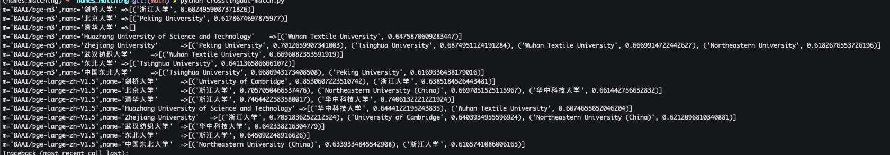

# Names Matching
1. sentence-transformers做大学相似度计算效果不好，中文支持不好，"清华大学"没法归一化到Tsinghua University
    1. SentenceTransformer可以调用BGE M3.
    1. SentenceTransformer中文文档， https://www.aidoczh.com/sbert/docs/installation.html
    1. SentenceTransformer英文文档，https://sbert.net/
    1. github: https://github.com/UKPLab/sentence-transformers
    1. SentenceTransformer各种应用场景举例: https://github.com/UKPLab/sentence-transformers?tab=readme-ov-file#application-examples
    1. Sentence Transformer models can be initialized with prompts and default_prompt_name parameters,  https://www.sbert.net/examples/sentence_transformer/applications/computing-embeddings/README.html#prompt-templates
1. PromptBert
    PromptBert是22年10月份提出的，以Bert为基底，通过选择合适的prompt（“This sentence:"[X]" means [MASK] ”）,然后以最后一层[MASK]位置的向量表征作为句向量，即便不经过额外的finetune也能取得令人惊艳的效果。这种方式的弊端在于严重依赖于的prompt的选取，不同的prompt所带来的差异天差地别。
1. BGE可以finetune, https://arthurchiao.art/blog/rag-basis-bge-zh/
1. bge m3和BGE V1.5对比:
    1. https://blog.csdn.net/flomingo1/article/details/146029629
    1. https://huggingface.co/BAAI/bge-m3/discussions/3
    1. https://zhuanlan.zhihu.com/p/1889076509584638806, RAG系统召回率低？ BGE-M3 多语言多功能重塑文本检索
1. https://huggingface.co/BAAI/bge-large-zh-v1.5
    1. 这里有各模型说明
    1. 用SentenceTransformer加载模型的样例代码
1. https://www.cnblogs.com/ting1/p/18550629 , RAG 系统高效检索提升秘籍：如何精准选择 BGE 智源、GTE 阿里与 Jina 等的嵌入与精排模型的完美搭配
    1. 里面有介绍各种embedding的效果
    1. 还有介绍Xorbits Inference (Xinference) 是一个开源平台，用于简化各种 AI 模型的运行和集成。借助 Xinference，您可以使用任何开源 LLM、嵌入模型和多模态模型在云端或本地环境中运行推理，并创建强大的 AI 应用。通过 Xorbits Inference，可以轻松地一键部署你自己的模型或内置的前沿开源模型。
1. https://arthurchiao.art/blog/rag-basis-bge-zh/, 大模型 RAG 基础：信息检索、文本向量化及 BGE-M3 embedding 实践（2024）
    1. 总结起来：embedding model 计算的相似度是粗粒度的，只能算粗排； reranker 对 embedding model 得到的若干结果再进行细排； 要体会和理解这种差异，还是要看基础 paper [BERT：预训练深度双向 Transformers 做语言理解（Google，2019）](https://arthurchiao.art/blog/bert-paper-zh/)。
1. https://github.com/wdndev/ai_interview_note/blob/main/docs/search/6.%E7%B2%BE%E6%8E%92.md ， 精排。 里面有介绍美团，知乎的搜索。
1. 训练LLM需要大量的算力和工程方法，Embedding Model一般比LLM的参数量少一个数量级，基本上是几亿的参数量。因此算力要求较低。但是模型小，也就意味着需要更加精巧的工程设计，模型越大反而容易“大力出奇迹”。
1. 

# 跨语言检索

从测试结果来看，OpenAI的embedding效果挺不错，可以支持跨语言检索。感兴趣的同学可以自己搭一个dify知识库，然后用`data/cross-lingual-rag.txt`测试一下。
1. 可以输入剑桥大学，输出combridge university 
1. 输入huazhong university of science and technology, 输出华中科技大学。 
1. 输入PKU，输出北京大学。
1. 输入武汉纺织大学, 输出Wuhan Textile University.

和BGE模型对比，BGE模型效果差很多, "BAAI/bge-m3", "BAAI/bge-large-zh-V1.5"跨语言能力都不行, 相比之下 bge-m3更差一点。代码在`crosslingual-match.py`。
